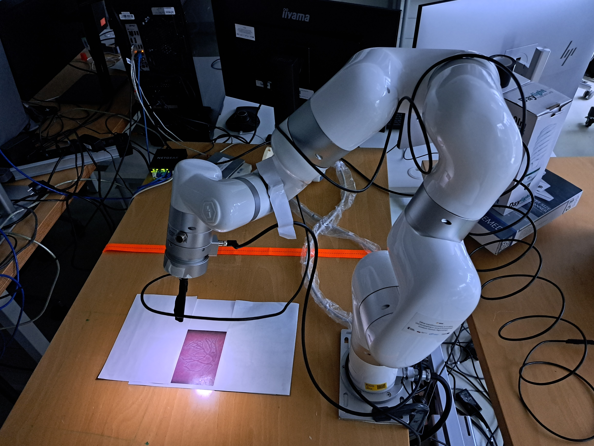

# TTTS-Simulation

**Project Description:**
This project is a part of a Master Thesis. Main goal this work is to create and run a simulation for a robotic arm to perform TTTS surgery. Robot will be trained using reinforcement learning on a custom created environment `TTTS-RL`. To simulate real situation, placenta image was generated using trained ControlNet network with Stable Diffusion and with pix2pix framework `Pix2Pix-Placenta`. Mapping process will include segmenting vessels to show clearer view of whole placenta. Segmentation was done with 2 methods: VTA algorithm `TTTS-VTA` and `TTTSNet`. All components will be combined inside MuJoCo simulation environment where the system will be tested as a whole. Last part of the work is sim2real transfer of knowledge from simulation to a real robot in laboratory.





## Table of Contents

- [Installation](#installation)
- [Usage](#usage)
- [Demo](#demo)


## Installation

### Steps

1. Clone the repository:

    ```sh
    git clone https://github.com/jkkrupinski/TTTS-Simulation.git
    cd TTTS_SIMULATION
    ```

2. Create a Conda environment (optional but recommended):

    ```sh
    conda env create -f environment.yaml
    conda activate my_env
    ```

3. Install dependencies:

    ```sh
    pip install -r requirements.txt
    ```


## Usage

### Main script

- To run a test of the trained model on the simulation environment run test_model.py script

    ```sh
    python tests/test_model.py
    ```


### Tests
Repository contains scripts for testing separate parts of the system.

- To run environment with agent taking random actions run environment.py script

    ```sh
    python tests/test_environment.py
    ```

- To run a test with maual steering using arrows run test_manual.py script

    ```sh
    python tests/test_manual.py
    ```

- To test gymnasium simulation environment run test_environment.py script

    ```sh
    python tests/test_environment.py
    ```

- To test basic controller steering run test_controller.py script

    ```sh
    python tests/test_controller.py
    ```


## Demo


[System demonstration](media/system.mp4)

[Simulation demonstration](media/simulation_cut.mp4)

[Sim2Real demonstration](media/real_demo.mp4)